<p align="center">
  
</p>

<p align="center">
  <a href="#-cat-profile"><code>01 / perfil</code></a> ·
  <a href="#-ls-projects"><code>02 / projetos</code></a> ·
  <a href="#-run-signal-lost"><code>03 / jogar</code></a> ·
  <a href="#-cat-telemetry"><code>04 / atividade</code></a> ·
  <a href="#-connect"><code>05 / contacto</code></a>
</p>

## $ cat profile

Sou o **Francisco Graça**, estudante universitário de **Engenharia Informática**, com interesse em **Cibersegurança** e **Desenvolvimento de Aplicações**.

```text
francisco@matrix:~$ cat interests.conf

[security]    compreender sistemas e as suas vulnerabilidades
[apps]        transformar ideias em aplicações
[learning]    construir bases sólidas, um projeto de cada vez
```

<p>
  <a href="https://en.cppreference.com/w/c.html"></a>
  <a href="https://www.python.org/"></a>
  <a href="https://developer.mozilla.org/en-US/docs/Web/JavaScript"></a>
  <a href="https://kotlinlang.org/"></a>
</p>

<details>
<summary>▸ expandir / formação e stack</summary>

**Formação:** estudante universitário de Engenharia Informática.


</details>

## $ ls projects

**O código faz parte do percurso.** Explora os meus projetos e acompanha o que vou construindo.

[](https://github.com/FranciscoGraca1?tab=repositories)

## $ run signal-lost

```text
┌─ SIGNAL LOST / terminal puzzle ────────────────────────┐
│ Uma mensagem ficou presa num terminal de treino.      │
│ Recupera a flag: três portas, três escolhas.           │
│ Duração: ~1 minuto. Abre uma opção para avançar.       │
└──────────────────────────────────────────────────────┘
```

<details>
<summary>▶ INICIAR / estabelecer ligação</summary>

### 01 — O sinal

O terminal devolve `01000110 01000111`. São dois bytes em ASCII. Que mensagem recebeste?

<details>
<summary>▸ A / 01</summary>

`[ RETRY ]` Lê cada grupo de oito bits como um carácter. 01000110 corresponde ao número decimal 70.

</details>

<details>
<summary>▸ B / FG</summary>

`[ SIGNAL FOUND ]` Correto: 70 = F e 71 = G.

### 02 — A porta

Este terminal de treino precisa de permitir que leias **um único ficheiro**. Que acesso escolhes?

<details>
<summary>▸ A / acesso de administrador</summary>

`[ RETRY ]` É acesso a mais para esta tarefa. Escolhe apenas as permissões necessárias.

</details>

<details>
<summary>▸ B / leitura apenas desse ficheiro</summary>

`[ ACCESS SCOPED ]` Princípio do menor privilégio: apenas o acesso necessário.

### 03 — A mensagem

O ficheiro contém `Rkc=` e a nota `encoding: base64`. O que fazes?

<details>
<summary>▸ A / descodificar Base64</summary>

```text
$ decode Rkc=
FG

[ MISSION COMPLETE ]
flag{FG_signal_restored}

Mensagem recuperada. Bem-vindo ao meu perfil.
```

**Conseguiste recuperar o sinal.** Base64 é uma codificação reversível, não uma forma de cifragem.

[Continuar a explorar os projetos →](https://github.com/FranciscoGraca1?tab=repositories)

</details>

<details>
<summary>▸ B / procurar uma chave de desencriptação</summary>

`[ RETRY ]` Base64 não requer uma chave: é uma codificação. Tenta a outra opção.

</details>

</details>

</details>

<details>
<summary>▸ C / FF</summary>

`[ RETRY ]` Os dois bytes são diferentes. O segundo carácter vem imediatamente depois de F.

</details>

</details>

<sub>Jogo de escolhas no README. Sem temporizador ou pontuação guardada. Para reiniciar, atualiza a página.</sub>

## $ cat telemetry

<p align="center">
  
</p>

<details>
<summary>▸ activity.log / última atividade pública</summary>

<!-- CURRENTLY:START -->
💻 Repositório público com push mais recente: <a href="https://github.com/FranciscoGraca1/PW_22409338_FranciscoGraca">PW_22409338_FranciscoGraca</a>

🧩 Linguagem principal: JavaScript  
🕒 Último push: 14/06/2026 às 21:55 UTC

<sub>Atividade do repositório; pode incluir pushes de colaboradores ou bots.</sub>

<sub>Última verificação: 14/09/2026 (UTC).</sub>
<!-- CURRENTLY:END -->

<sub>Atualização diária. A atividade do repositório pode incluir colaboradores ou bots; não indica presença em tempo real.</sub>

</details>

<details>
<summary>▸ stats / estatísticas e linguagens</summary>

<p align="center">
  
  
  <a href="https://streak-stats.demolab.com/?user=FranciscoGraca1&amp;theme=dark">Consultar streak de contribuições ↗</a>
</p>

<sub>As linguagens refletem o código contabilizado, não o nível de domínio. O streak inclui contribuições além de commits.</sub>

</details>

## $ connect

<p align="center">
  <a href="mailto:franciscofilipegraca@gmail.com"></a>
  <a href="https://www.linkedin.com/in/francisco-gra%C3%A7a-08453b220/"></a>
  <a href="https://github.com/FranciscoGraca1?tab=followers"></a>
</p>

<p align="center"><sub><code>francisco@matrix:~$ exit · a próxima linha ainda está por escrever.</code></sub></p>
